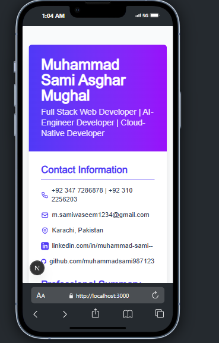

# Resume Next.js Web App


## 🚀 Overview

Resume Next.js Web App is a modern, fully responsive, and customizable digital resume/CV template built with [Next.js](https://nextjs.org/) and [Tailwind CSS](https://tailwindcss.com/). Designed for developers, designers, and professionals who want to showcase their skills, experience, and projects in a beautiful, interactive, and easily shareable format. This project is perfect for personal branding, job applications, and portfolio websites.

---

## 🌟 Features

- **Modern UI/UX:** Clean, professional, and visually appealing design using Tailwind CSS.
- **Fully Responsive:** Looks great on all devices—mobile, tablet, and desktop.
- **Easy Customization:** All content is managed in a single React component for quick edits.
- **Sectioned Layout:** Includes Contact Info, Professional Summary, Education, Projects, Skills, Experience, Freelance Work, Certifications, and Languages.
- **Accessible:** Semantic HTML and accessible color contrast.
- **Live Preview:** See changes instantly with hot reloading.
- **Deploy-Ready:** Easily deploy to Vercel, Netlify, or any Next.js-compatible platform.
- **SEO Optimized:** Good structure for search engine visibility.
- **Open Source:** MIT licensed for personal and commercial use.

---

## 🛠️ Tech Stack

- **Framework:** [Next.js](https://nextjs.org/)
- **UI Library:** [React](https://reactjs.org/)
- **Styling:** [Tailwind CSS](https://tailwindcss.com/)
- **Icons:** [Heroicons](https://heroicons.com/)
- **Deployment:** [Vercel](https://vercel.com/) (recommended), Netlify, or any Node.js host

---

## 📸 Screenshots

> _Add your own screenshots in the `public/` folder and update the path above._



---

## 🌐 Live Demo

[Live Demo on Vercel](https://your-vercel-demo-link.vercel.app)

---

## ⚡ Getting Started

### Prerequisites
- [Node.js](https://nodejs.org/) (v16 or later recommended)
- npm or yarn

### Installation
1. **Clone the repository:**
   ```bash
   git clone https://github.com/yourusername/your-resume-nextjs.git
   cd your-resume-nextjs
   ```
2. **Install dependencies:**
   ```bash
   npm install
   # or
   yarn install
   ```
3. **Run the development server:**
   ```bash
   npm run dev
   # or
   yarn dev
   ```
4. **Open your browser:**
   Visit [http://localhost:3000](http://localhost:3000)

---

## 📝 Customization

- **Edit Resume Content:**
  - All resume data is in `src/components/Resume.tsx`. Update your name, contact info, summary, education, projects, skills, and more.
- **Change Styles:**
  - Modify Tailwind CSS classes directly in the JSX for colors, spacing, and layout.
- **Add/Remove Sections:**
  - Duplicate or remove sections in the `Resume.tsx` file as needed.
- **Update Icons:**
  - Use [Heroicons](https://heroicons.com/) or any SVG icon library.
- **SEO & Metadata:**
  - Update `pages/_document.js` and `pages/_app.js` for custom meta tags and favicon.

---

## 🚀 Deployment

### Deploy to Vercel (Recommended)
1. Push your code to GitHub.
2. Go to [Vercel](https://vercel.com/import) and import your repository.
3. Follow the prompts to deploy. Your site will be live in seconds!

### Other Platforms
- **Netlify:** Connect your repo and set build command to `npm run build` and publish directory to `.next`.
- **Static Export:** Use `next export` for a static site (with limitations).

---

## 🤝 Contributing

Contributions are welcome! To contribute:
1. Fork the repository
2. Create a new branch (`git checkout -b feature/your-feature`)
3. Commit your changes (`git commit -m 'Add some feature'`)
4. Push to the branch (`git push origin feature/your-feature`)
5. Open a Pull Request

---

## ❓ FAQ

**Q: Can I use this template for commercial projects?**
> Yes! This project is MIT licensed.

**Q: How do I add a new section?**
> Duplicate a section block in `Resume.tsx` and update the content.

**Q: How do I change the color scheme?**
> Edit Tailwind config or use different utility classes in your JSX.

**Q: Can I deploy this as a static site?**
> Yes, but some Next.js features may require server-side rendering.

**Q: Where do I add my own images or profile photo?**
> Place them in the `public/` directory and reference them in your component.

---

## 👤 Author

**Muhammad Sami Asghar Mughal**  
[LinkedIn](https://linkedin.com/in/muhammad-sami--)  
[GitHub](https://github.com/muhammadsami987123)  
[Email](mailto:m.samiwaseem1234@gmail.com)

---

## 🙏 Credits

- [Next.js](https://nextjs.org/)
- [Tailwind CSS](https://tailwindcss.com/)
- [Heroicons](https://heroicons.com/)
- [Vercel](https://vercel.com/)

---

## 📄 License

This project is licensed under the [MIT License](LICENSE). You are free to use, modify, and distribute this template for personal and commercial purposes.

---

> _If you like this project, please star the repository and share it with others!_ 